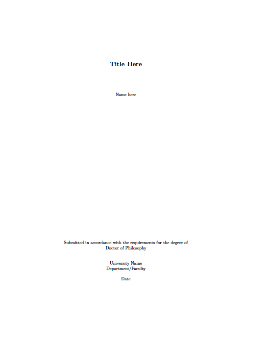
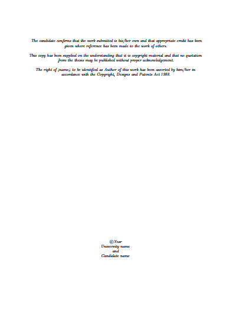
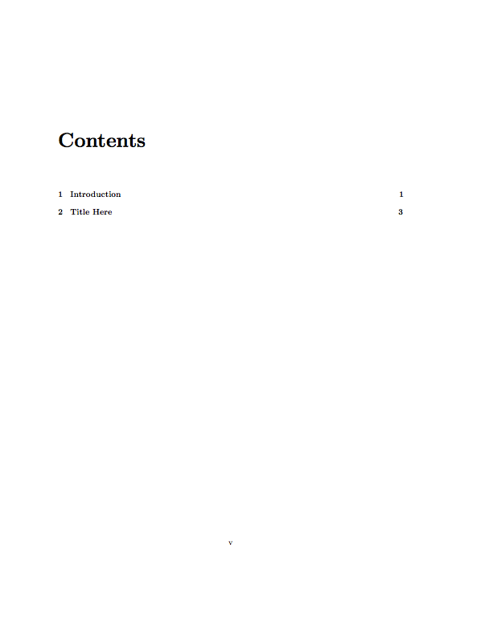
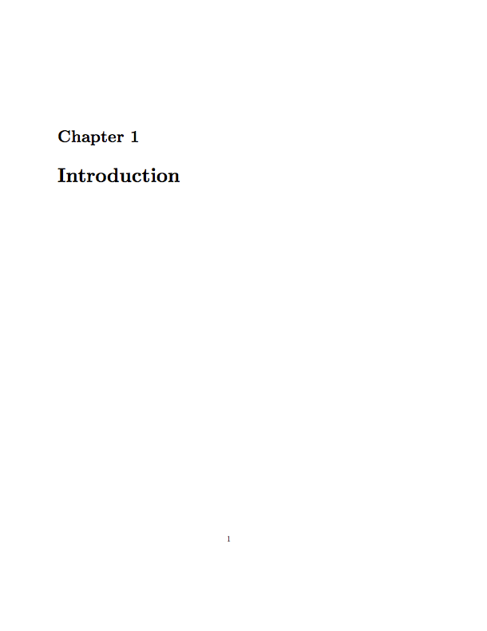

# Thesis
Thesis template in LaTeX

I've created a bare, simple but effective template in LaTeX for my thesis but I'd be happy for others to be able to use it too.
Please feel free to make suggested changes as you see fit.
The file structure is as follows:

-thesis.tex: this is the main tex file which access all others.

-Front: contains all tex files for title acknowledgements etc.

-Main: contains tex fils for chapters.

-Back: contains tex files for figures and tables input at the end of thesis.

-packages.tex: contains all packages called on by the template.

Here are a few selected screenshots of the compiled template (screenshots are rubbish and vary in size but gives you a rough idea):

